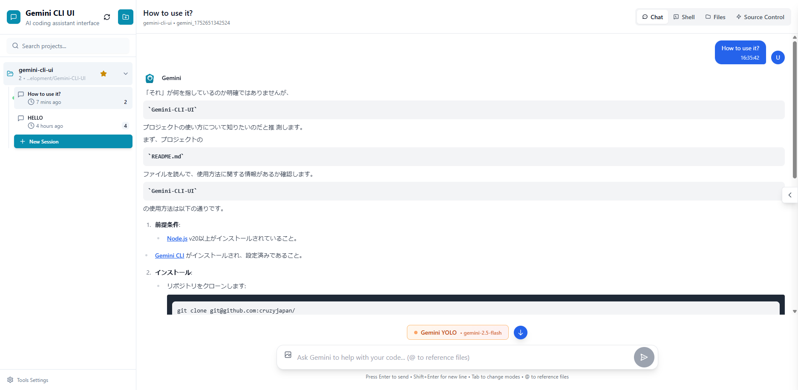
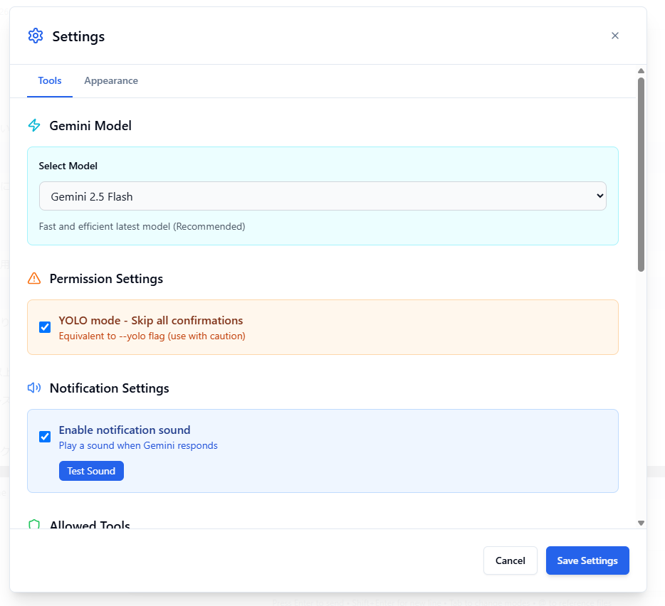
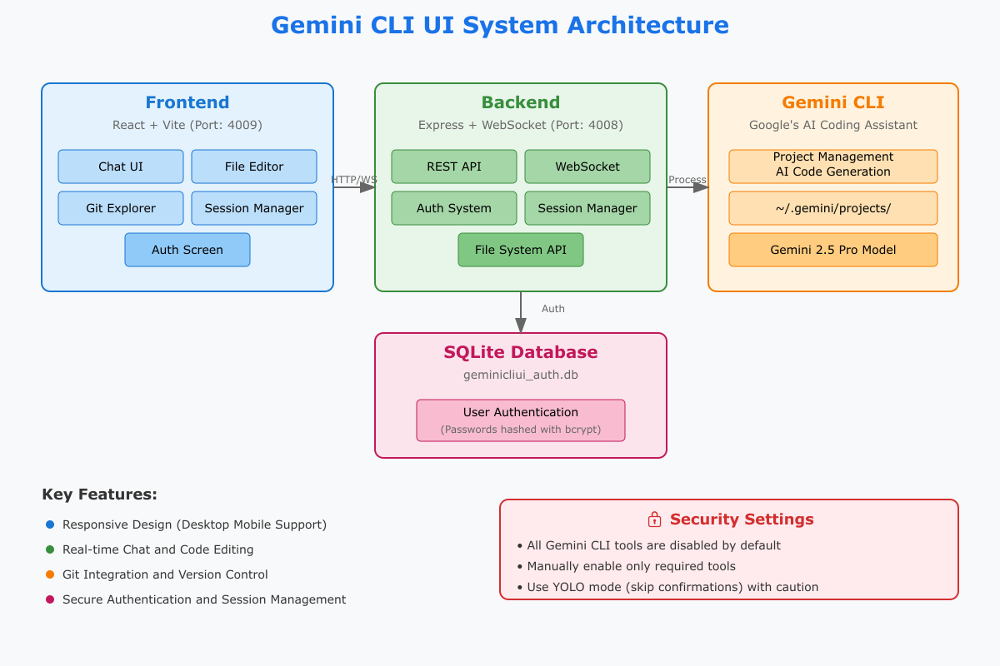

<div align="center">
  
  <h1>Gemini CLI Web UI</h1>
  <h3>Gemini CLI 网页用户界面</h3>
</div>


A desktop and mobile UI for [Gemini CLI](https://github.com/google-gemini/gemini-cli), Google's official CLI for AI-assisted coding. You can use it locally or remotely to view your active projects and sessions in Gemini CLI and make changes to them the same way you would do it in Gemini CLI. This gives you a proper interface that works everywhere.

[Gemini CLI](https://github.com/google-gemini/gemini-cli) 的桌面和移动端用户界面，Google 官方用于 AI 辅助编程的 CLI 工具。您可以在本地或远程使用它来查看 Gemini CLI 中的活动项目和会话，并以与在 Gemini CLI 中相同的方式对其进行更改。这为您提供了一个可在任何地方使用的合适界面。

## Technologies Used / 使用的技术


## Screenshots / 屏幕截图

<div align="center">
<table>
<tr>
<td align="center">
<h3>Chat View / 聊天界面</h3>

<br>
<em>Main interface showing project overview and chat / 显示项目概览和聊天的主界面</em>
</td>
<td align="center">
<h3>Settings / 设置</h3>

<br>
<em>Setting / 设置</em>
</td>
</tr>
</table>
<table>
<tr>
<td align="center">
<h3>Chat View / 聊天界面</h3>

<br>
<em>Gemini CLI UI Diagram / Gemini CLI UI 架构图</em>
</td>
</table>
</div align="center">

<div align="center">
<h3>Updates to Gemini CLI Web UI / Gemini CLI Web UI 更新</h3>

<em>Monaco Code Editor for editing files in Gemini CLI UI / 在 Gemini CLI UI 中编辑文件的 Monaco 代码编辑器</em>
<br>


<em>Spec File Generation / 规范文件生成</em>
<br>

</div align="center">

## Features / 功能特性

- **Responsive Design** - Works seamlessly across desktop, tablet, and mobile so you can also use Gemini CLI from mobile
- **Interactive Chat Interface** - Built-in chat interface for seamless communication with Gemini CLI
- **Integrated Shell Terminal** - Direct access to Gemini CLI through built-in shell functionality
- **File Explorer** - Interactive file tree with syntax highlighting and live editing
- **Git Explorer** - View, stage and commit your changes. You can also switch branches
- **Session Management** - Resume conversations, manage multiple sessions, and track history
- **Model Selection** - Choose from multiple Gemini models including Gemini 2.5 Pro
- **YOLO Mode** - Skip confirmation prompts for faster operations (use with caution)

- **响应式设计** - 在桌面、平板和移动设备上无缝工作，您也可以从移动设备使用 Gemini CLI
- **交互式聊天界面** - 内置聊天界面，与 Gemini CLI 进行无缝通信
- **集成 Shell 终端** - 通过内置 shell 功能直接访问 Gemini CLI
- **文件浏览器** - 具有语法高亮和实时编辑功能的交互式文件树
- **Git 浏览器** - 查看、暂存和提交您的更改，还可以切换分支
- **会话管理** - 恢复对话、管理多个会话并跟踪历史记录
- **模型选择** - 从多个 Gemini 模型中选择，包括 Gemini 2.5 Pro
- **YOLO 模式** - 跳过确认提示以加快操作速度（谨慎使用）

## Quick Start / 快速开始

### Prerequisites / 先决条件

- [Node.js](https://nodejs.org/) v20 or higher / v20 或更高版本
- [Gemini CLI](https://github.com/google-gemini/gemini-cli) installed and configured / 已安装并配置

### Installation / 安装

1. **Clone the repository: / 克隆仓库:**

```bash
git clone https://github.com/ssdeanx/Gemini-CLI-Web.git
cd gemini-cli-web
```

2. **Install dependencies: / 安装依赖:**

```bash
npm install
```

3. **Configure environment: / 配置环境:**

```bash
cp .env.example .env
# Edit .env with your preferred settings / 使用您偏好的设置编辑 .env
```

**Note**: The `.env` file has been removed for security. Always copy `.env.example` to `.env` when using and modify settings as needed.
**注意**: 出于安全原因，`.env` 文件已被删除。使用时始终将 `.env.example` 复制到 `.env` 并根据需要修改设置。

4. **Start the application: / 启动应用:**

```bash
# Development mode (with hot reload) / 开发模式（带热重载）
npm run dev
```

The application will start at the port you specified in your .env
应用将在您在 .env 中指定的端口启动

5. **Open your browser: / 打开浏览器:**
   - Development: `http://localhost:4009`

## Security & Tools Configuration / 安全与工具配置

**🔒 Important Notice**: All Gemini CLI tools are **disabled by default**. This prevents potentially harmful operations from running automatically.
**🔒 重要通知**: 所有 Gemini CLI 工具默认**禁用**。这可以防止潜在有害操作自动运行。

### Enabling Tools / 启用工具

To use Gemini CLI's full functionality, you'll need to manually enable tools:
要使用 Gemini CLI 的全部功能，您需要手动启用工具：

1. **Open Tools Settings** - Click the gear icon in the sidebar
2. **Enable Selectively** - Turn on only the tools you need
3. **Apply Settings** - Your preferences are saved locally

1. **打开工具设置** - 点击侧边栏中的齿轮图标
2. **选择性启用** - 仅开启您需要的工具
3. **应用设置** - 您的偏好设置会本地保存

### About YOLO Mode / 关于 YOLO 模式

YOLO mode ("You Only Live Once") is equivalent to Gemini CLI's `--yolo` flag, skipping all confirmation prompts. This mode speeds up your work but should be used with caution.
YOLO 模式（"你只活一次"）相当于 Gemini CLI 的 `--yolo` 标志，跳过所有确认提示。此模式可加快您的工作速度，但应谨慎使用。

**Recommended approach**: Start with basic tools enabled and add more as needed. You can always adjust these settings later.
**推荐方法**: 从启用基本工具开始，根据需要添加更多工具。您可以随时调整这些设置。

## Usage Guide / 使用指南

### Core Features / 核心功能

#### Project Management / 项目管理

The UI automatically discovers Gemini CLI projects from `~/.gemini/projects/` and provides:
UI 会自动从 `~/.gemini/projects/` 发现 Gemini CLI 项目并提供：

- **Visual Project Browser** - All available projects with metadata and session counts
- **Project Actions** - Rename, delete, and organize projects
- **Smart Navigation** - Quick access to recent projects and sessions

- **可视化项目浏览器** - 所有可用项目及其元数据和会话计数
- **项目操作** - 重命名、删除和组织项目
- **智能导航** - 快速访问最近的项目和会话

#### Chat Interface / 聊天界面

- **Use responsive chat or Gemini CLI** - You can either use the adapted chat interface or use the shell button to connect to Gemini CLI
- **Real-time Communication** - Stream responses from Gemini with WebSocket connection
- **Session Management** - Resume previous conversations or start fresh sessions
- **Message History** - Complete conversation history with timestamps and metadata
- **Multi-format Support** - Text, code blocks, and file references
- **Image Upload** - Upload and ask questions about images in chat

- **使用响应式聊天或 Gemini CLI** - 您可以使用适配的聊天界面，或使用 shell 按钮连接 Gemini CLI
- **实时通信** - 通过 WebSocket 连接流式传输 Gemini 的响应
- **会话管理** - 恢复之前的对话或开始新的会话
- **消息历史** - 带有时间戳和元数据的完整对话历史
- **多格式支持** - 文本、代码块和文件引用
- **图片上传** - 上传图片并在聊天中提问

#### File Explorer & Editor / 文件浏览器和编辑器

- **Interactive File Tree** - Browse project structure with expand/collapse navigation
- **Live File Editing** - Read, modify, and save files directly in the interface
- **Syntax Highlighting** - Support for multiple programming languages
- **File Operations** - Create, rename, delete files and directories

- **交互式文件树** - 通过展开/折叠导航浏览项目结构
- **实时文件编辑** - 直接在界面中读取、修改和保存文件
- **语法高亮** - 支持多种编程语言
- **文件操作** - 创建、重命名、删除文件和目录

#### Git Explorer / Git 浏览器

- **Visualize Changes** - See current changes in real-time
- **Stage and Commit** - Create Git commits directly from the UI
- **Branch Management** - Switch and manage branches

- **可视化更改** - 实时查看当前更改
- **暂存和提交** - 直接从 UI 创建 Git 提交
- **分支管理** - 切换和管理分支

#### Session Management / 会话管理

- **Session Persistence** - All conversations automatically saved
- **Session Organization** - Group sessions by project and timestamp
- **Session Actions** - Rename, delete, and export conversation history
- **Cross-device Sync** - Access sessions from any device

- **会话持久化** - 所有对话自动保存
- **会话组织** - 按项目和时间戳分组会话
- **会话操作** - 重命名、删除和导出对话历史
- **跨设备同步** - 从任何设备访问会话

### Mobile App / 移动应用

- **Responsive Design** - Optimized for all screen sizes
- **Touch-friendly Interface** - Swipe gestures and touch navigation
- **Mobile Navigation** - Bottom tab bar for easy thumb navigation
- **Adaptive Layout** - Collapsible sidebar and smart content prioritization
- **Add to Home Screen** - Add a shortcut to your home screen and the app will behave like a PWA

- **响应式设计** - 针对所有屏幕尺寸进行优化
- **触摸友好界面** - 滑动手势和触摸导航
- **移动导航** - 底部标签栏便于拇指导航
- **自适应布局** - 可折叠侧边栏和智能内容优先级
- **添加到主屏幕** - 在主屏幕上添加快捷方式，应用将像 PWA 一样运行

### Monaco Editor / Monaco 编辑器

- **Monaco Editor** - Advanced code editor with syntax highlighting and live editing
- **Code Completion** - Autocomplete features for code snippets and functions
- **Syntax Highlighting** - Highlighting of different programming languages
- **Live Editing** - Edit code directly in the editor
- **Code Folding** - Collapse and expand code blocks for better readability
- **Chat Modal** - Chat mode that can interact with the Monaco Editor

- **Monaco 编辑器** - 具有语法高亮和实时编辑功能的高级代码编辑器
- **代码补全** - 代码片段和函数的自动补全功能
- **语法高亮** - 不同编程语言的高亮显示
- **实时编辑** - 直接在编辑器中编辑代码
- **代码折叠** - 折叠和展开代码块以提高可读性
- **聊天模式** - 可以与 Monaco 编辑器交互的聊天模式

### Spec File Generation / 规范文件生成

- **Spec File Generation** - Generate design, requirements, and tasks files
- **Design File Generation** - Generate design files for UI
- **Requirements File Generation** - Generate requirements files for testing
- **Tasks File Generation** - Generate tasks files for automation
- **User Input** - User input is used to generate the spec files
- **Retry and Save** - Retry and save the generated spec files
- **Save Spec Files** - Save the generated spec files, in the project spec folder
- **Use Spec Files** - Use the generated spec files in Gemini CLI for further development, features, and more.

- **规范文件生成** - 生成设计、需求和任务文件
- **设计文件生成** - 为 UI 生成设计文件
- **需求文件生成** - 为测试生成需求文件
- **任务文件生成** - 为自动化生成任务文件
- **用户输入** - 使用用户输入生成规范文件
- **重试和保存** - 重试并保存生成的规范文件
- **保存规范文件** - 将生成的规范文件保存到项目 spec 文件夹中
- **使用规范文件** - 在 Gemini CLI 中使用生成的规范文件进行进一步的开发、功能扩展等

## Architecture / 架构

### System Overview / 系统概览

```bash
┌─────────────────┐    ┌─────────────────┐    ┌─────────────────┐
│   Frontend      │    │   Backend       │    │  Gemini CLI     │
│   (React/Vite)  │◄──►│ (Express/WS)    │◄──►│  Integration    │
└─────────────────┘    └─────────────────┘    └─────────────────┘
```

### Backend (Node.js + Express) / 后端（Node.js + Express）

- **Express Server** - RESTful API with static file serving (Port: 4008)
- **WebSocket Server** - Communication for chats and project refresh
- **Gemini CLI Integration** - Process spawning and management
- **Session Management** - JSONL parsing and conversation persistence
- **File System API** - Exposing file browser for projects
- **Authentication System** - Secure login and session management (SQLite database: geminicliui_auth.db)

- **Express 服务器** - 具有静态文件服务的 RESTful API（端口：4008）
- **WebSocket 服务器** - 用于聊天和项目刷新的通信
- **Gemini CLI 集成** - 进程生成和管理
- **会话管理** - JSONL 解析和对话持久化
- **文件系统 API** - 为项目公开文件浏览器
- **认证系统** - 安全登录和会话管理（SQLite 数据库：geminicliui_auth.db）

### Frontend (React + Vite) / 前端（React + Vite）

- **React 18** - Modern component architecture with hooks
- **CodeMirror** - Advanced code editor with syntax highlighting
- **Tailwind CSS** - Utility-first CSS framework
- **Responsive Design** - Mobile-first approach

- **React 18** - 带有钩子的现代组件架构
- **CodeMirror** - 具有语法高亮功能的高级代码编辑器
- **Tailwind CSS** - 实用优先的 CSS 框架
- **响应式设计** - 移动优先的方法

## Configuration Details / 配置详情

### Port Settings / 端口设置

- **API Server**: Port 4008 (default) / 端口 4008（默认）
- **Frontend Dev Server**: Port 4009 (default) / 端口 4009（默认）
- These ports can be changed in the `.env` file / 这些端口可以在 `.env` 文件中更改

### Database Configuration / 数据库配置

#### Initial Setup and Table Structure / 初始设置和表结构

- **Database File**: `server/database/geminicliui_auth.db`
- **Database Type**: SQLite 3
- **Initialization**: Automatically created and initialized on server startup

- **数据库文件**: `server/database/geminicliui_auth.db`
- **数据库类型**: SQLite 3
- **初始化**: 在服务器启动时自动创建和初始化

#### User Table Details / 用户表详情

**Table Name**: `geminicliui_users`

| Column | Data Type | Constraints | Description |
|--------|-----------|-------------|-------------|
| `id` | INTEGER | PRIMARY KEY AUTOINCREMENT | Unique user identifier |
| `username` | TEXT | UNIQUE NOT NULL | Login username (email recommended) |
| `password_hash` | TEXT | NOT NULL | bcrypt hashed password |
| `created_at` | DATETIME | DEFAULT CURRENT_TIMESTAMP | Account creation timestamp |
| `last_login` | DATETIME | NULL | Last login timestamp |
| `is_active` | BOOLEAN | DEFAULT 1 | Account active/inactive status |

| 列 | 数据类型 | 约束 | 描述 |
|--------|-----------|-------------|-------------|
| `id` | INTEGER | 主键自增 | 唯一用户标识符 |
| `username` | TEXT | 唯一非空 | 登录用户名（推荐邮箱） |
| `password_hash` | TEXT | 非空 | bcrypt 哈希密码 |
| `created_at` | DATETIME | 默认当前时间戳 | 账户创建时间戳 |
| `last_login` | DATETIME | 可为空 | 最后登录时间戳 |
| `is_active` | BOOLEAN | 默认 1 | 账户激活/未激活状态 |

**Indexes**:
**索引**:

- `idx_geminicliui_users_username`: For fast username lookups / 用于快速用户名查找
- `idx_geminicliui_users_active`: For filtering active users / 用于过滤活跃用户

#### First Run Setup / 首次运行设置

1. On first server startup, database file is automatically created if it doesn't exist
2. Table structure is loaded from `server/database/init.sql`
3. First access displays user registration screen
4. First user is registered as administrator

1. 首次服务器启动时，如果数据库文件不存在会自动创建
2. 表结构从 `server/database/init.sql` 加载
3. 首次访问显示用户注册界面
4. 第一个用户注册为管理员

#### Security Features / 安全特性

- Passwords are hashed with bcrypt before storage / 密码在存储前使用 bcrypt 哈希
- JWT token-based authentication system / 基于 JWT 令牌的认证系统
- Session management with timeout functionality / 具有超时功能的会话管理
- SQL injection protection (prepared statements used) / SQL 注入保护（使用预处理语句）

## Troubleshooting / 故障排除

### Common Issues & Solutions / 常见问题和解决方案

#### "No Gemini projects found" / "未找到 Gemini 项目"

**Problem**: The UI shows no projects or empty project list
**Solutions**:

- Ensure Gemini CLI is properly installed
- Run `gemini` command in at least one project directory to initialize
- Verify `~/.gemini/projects/` directory exists and has proper permissions

**问题**: UI 显示没有项目或空的项目列表
**解决方案**:

- 确保 Gemini CLI 已正确安装
- 至少在一个项目目录中运行 `gemini` 命令进行初始化
- 验证 `~/.gemini/projects/` 目录存在并具有适当权限

#### File Explorer Issues / 文件浏览器问题

**Problem**: Files not loading, permission errors, empty directories
**Solutions**:

- Check project directory permissions (`ls -la` in terminal)
- Verify the project path exists and is accessible
- Review server console logs for detailed error messages
- Ensure you're not trying to access system directories outside project scope

**问题**: 文件未加载、权限错误、空目录
**解决方案**:

- 检查项目目录权限（在终端中使用 `ls -la`）
- 验证项目路径存在且可访问
- 查看服务器控制台日志获取详细错误信息
- 确保您没有尝试访问项目范围外的系统目录

#### Model Selection Not Working / 模型选择不工作

**Problem**: Selected model is not being used
**Solutions**:

- After selecting a model in settings, make sure to click "Save Settings"
- Clear browser local storage and reconfigure
- Verify the model name is displayed correctly in the chat interface

**问题**: 选择的模型未被使用
**解决方案**:

- 在设置中选择模型后，确保点击"保存设置"
- 清除浏览器本地存储并重新配置
- 验证模型名称在聊天界面中正确显示

## Future Scope / 未来规划

This section outlines the planned enhancements and features to be implemented in future releases, focusing on improving user experience, agent capabilities, and overall system performance.
本节概述了计划在将来版本中实现的增强功能和特性，重点在于改善用户体验、代理能力和整体系统性能。

| Feature | Description | Status/Priority |
|---|---|---|
| **Centralized MCP Server Configuration** | Load MCP server configurations from `~/.gemini/settings.json` for consistent management across CLI and UI. | High |
| **Code Graph Generator & Visualization** | Dedicated `CodeGraph.jsx` component using `xyflow/react` and `mermaid.js` for interactive and static code graph visualizations (call graphs, dependency graphs, etc.). | High |
| **Enhanced Specification Design** | Transform `SpecDesign.jsx` into a comprehensive tool with interactive refinement, Git integration, template support, AI-driven validation, and Mermaid diagram generation. | High |
| **Transparent Tool Calls & Thinking** | New component in `ChatInterface.jsx` to display Gemini's internal thought process and tool invocations/outputs for enhanced transparency. | High |
| **Direct Code Editing & Diff in Chat** | Enable inline code editing within chat responses and real-time diff visualization for immediate feedback on code changes. | High |
| **Frontend Credential Caching** | Optimize authentication credential loading in `AuthContext.jsx`, `api.js`, and `websocket.js` using an in-memory cache to reduce `localStorage` lookups and improve performance. | Medium |

| 功能 | 描述 | 状态/优先级 |
|---|---|---|
| **集中式 MCP 服务器配置** | 从 `~/.gemini/settings.json` 加载 MCP 服务器配置，实现 CLI 和 UI 的一致管理。 | 高 |
| **代码图生成器和可视化** | 使用 `xyflow/react` 和 `mermaid.js` 的专用 `CodeGraph.jsx` 组件，用于交互式和静态代码图可视化（调用图、依赖图等）。 | 高 |
| **增强的规范设计** | 将 `SpecDesign.jsx` 转换为具有交互式优化、Git 集成、模板支持、AI 驱动验证和 Mermaid 图表生成的综合工具。 | 高 |
| **透明的工具调用和思考** | `ChatInterface.jsx` 中的新组件，显示 Gemini 的内部思考过程和工具调用/输出，提高透明度。 | 高 |
| **聊天中的直接代码编辑和差异** | 在聊天响应中启用内联代码编辑和实时差异可视化，为代码更改提供即时反馈。 | 高 |
| **前端凭据缓存** | 使用内存缓存优化 `AuthContext.jsx`、`api.js` 和 `websocket.js` 中的认证凭据加载，减少 `localStorage` 查找并提高性能。 | 中 |

## License / 许可证

GNU General Public License v3.0 - see [LICENSE](LICENSE) file for details.
GNU 通用公共许可证 v3.0 - 详见 [LICENSE](LICENSE) 文件。

This project is open source and free to use, modify, and distribute under the GPL v3 license.
本项目是开源的，可以根据 GPL v3 许可证免费使用、修改和分发。

### Original Project / 原始项目

This project is based on [Claude Code UI](https://github.com/siteboon/claudecodeui) (GPL v3.0) with customizations.
本项目基于 [Claude Code UI](https://github.com/siteboon/claudecodeui)（GPL v3.0）并进行定制化修改。

### Graph / 架构图

```mermaid
graph TD
    subgraph User
        A[User]
    end

    subgraph Browser (Frontend)
        subgraph "React UI Components"
            App(App.jsx)
            MainContent(MainContent.jsx)
            Sidebar(Sidebar.jsx)
            ChatInterface(ChatInterface.jsx)
            EditorTab(EditorTab.jsx)
            GitPanel(GitPanel.jsx)
            Shell(Shell.jsx)
            ChatSidebar(ChatSidebar.jsx)
            CodeEditor(CodeEditor.jsx)
            CodeTabs(CodeTabs.jsx)
            DarkModeToggle(DarkModeToggle.jsx)
            EditorFileTree(EditorFileTree.jsx)
            ErrorBoundary(ErrorBoundary.jsx)
            FileTree(FileTree.jsx)
            GeminiLogo(GeminiLogo.jsx)
            GeminiStatus(GeminiStatus.jsx)
            ImageViewer(ImageViewer.jsx)
            LoginForm(LoginForm.jsx)
            MicButton(MicButton.jsx)
            MobileNav(MobileNav.jsx)
            NewCodeEditor(NewCodeEditor.jsx)
            ProtectedRoute(ProtectedRoute.jsx)
            QuickSettingsPanel(QuickSettingsPanel.jsx)
            SetupForm(SetupForm.jsx)
            TodoList(TodoList.jsx)
            ToolsSettings(ToolsSettings.jsx)
            SpecDesign(SpecDesign.jsx)
            ProgressIndicator(ProgressIndicator.jsx)
            ThinkingIndicator(ThinkingIndicator.jsx)
            badge(badge.jsx)
            button(button.jsx)
            input(input.jsx)
            scroll_area(scroll-area.jsx)
        end
        subgraph "Contexts"
            AuthContext(AuthContext.jsx)
            ThemeContext(ThemeContext.jsx)
            SettingsContext(SettingsContext.jsx)
        end
        subgraph "Hooks"
            useWebSocket(useWebSocket.js)
            useAudioRecorder(useAudioRecorder.js)
            useVersionCheck(useVersionCheck.js)
        end
        subgraph "Utils"
            api(api.js)
            notificationSound(notificationSound.js)
            whisper(whisper.js)
            lib_utils(utils.js)
        end
    end

    subgraph "Node.js Server (Backend)"
        ExpressServer(Express Server)
        WebSocketServer(WebSocket Server)
        GeminiCLIBridg(Gemini CLI Bridge)
        SessionManager(Session Manager)
        AuthLayer(Auth Layer)
        GitAPI(Git API)
    end

    subgraph "Local System"
        GeminiCLIProcess(Gemini CLI Process)
        ProjectFiles(Project Files)
        GitRepository(Git Repository)
        SQLiteDB(SQLite DB)
        GeminiConfigFiles(gemini config files)
    end

    subgraph "External Services"
        OpenAIWhisperAPI(OpenAI Whisper API)
    end

    A -- Interacts --> App

    App --> MainContent
    App --> Sidebar
    App --> DarkModeToggle
    App --> ErrorBoundary
    App --> MobileNav
    App --> ProtectedRoute
    App --> useVersionCheck

    MainContent --> ChatInterface
    MainContent --> EditorTab
    MainContent --> GitPanel
    MainContent --> Shell
    MainContent --> ChatSidebar
    MainContent --> ImageViewer
    MainContent --> TodoList
    MainContent --> SpecDesign

    Sidebar --> FileTree
    Sidebar --> GeminiLogo
    Sidebar --> QuickSettingsPanel
    Sidebar --> ToolsSettings
    Sidebar --> api

    ChatInterface --> CodeEditor
    ChatInterface --> GeminiStatus
    ChatInterface --> MicButton
    ChatInterface --> useWebSocket
    ChatInterface --> api
    ChatInterface --> notificationSound

    EditorTab --> CodeTabs
    EditorTab --> EditorFileTree
    EditorTab --> NewCodeEditor

    SpecDesign --> ProgressIndicator
    SpecDesign --> ThinkingIndicator

    AuthContext --> LoginForm
    AuthContext --> SetupForm

    MicButton --> useAudioRecorder
    useAudioRecorder --> whisper

    App --> AuthContext
    App --> ThemeContext
    App --> SettingsContext
    App --> useWebSocket

    api --> ExpressServer
    useWebSocket --> WebSocketServer

    ExpressServer --> GeminiCLIBridg
    WebSocketServer --> GeminiCLIBridg
    ExpressServer --> AuthLayer
    ExpressServer --> GitAPI
    ExpressServer --> ProjectFiles
    ExpressServer --> OpenAIWhisperAPI

    GeminiCLIBridg --> SessionManager
    GeminiCLIBridg --> GeminiCLIProcess

    AuthLayer --> SQLiteDB
    GitAPI --> GitRepository
    SessionManager --> GeminiConfigFiles
    GeminiCLIProcess --> ProjectFiles
end
```

**Major Changes: / 主要变更:**

- Adapted from Claude CLI to Gemini CLI / 从 Claude CLI 适配到 Gemini CLI
- Added authentication system (SQLite-based) / 添加了认证系统（基于 SQLite）
- Gemini-specific model selection feature / Gemini 特定的模型选择功能
- Enhanced Japanese language support / 增强的日语语言支持
- UI adjustments and Gemini branding / UI 调整和 Gemini 品牌标识

Thanks to the original Claude Code UI project.
感谢原始的 Claude Code UI 项目。

## Acknowledgments / 致谢

### Built With / 构建工具

- **[Gemini CLI](https://github.com/google-gemini/gemini-cli)** - Google's official CLI / Google 官方 CLI
- **[React](https://react.dev/)** - User interface library / 用户界面库
- **[Vite](https://vitejs.dev/)** - Fast build tool and dev server / 快速构建工具和开发服务器
- **[Tailwind CSS](https://tailwindcss.com/)** - Utility-first CSS framework / 实用优先的 CSS 框架
- **[CodeMirror](https://codemirror.net/)** - Advanced code editor / 高级代码编辑器
- **[Gemini CLI UI](https://github.com/cruzyjapan/Gemini-CLI-UI)** - Orginal project / 原始项目

## Support & Community / 支持与社区

### Stay Updated / 保持更新

- **Star** this repository to show support / **Star** 此仓库以示支持
- **Watch** for updates and new releases / **Watch** 以获取更新和新版本
- **Follow** the project for announcements / **Follow** 项目以获取公告

---